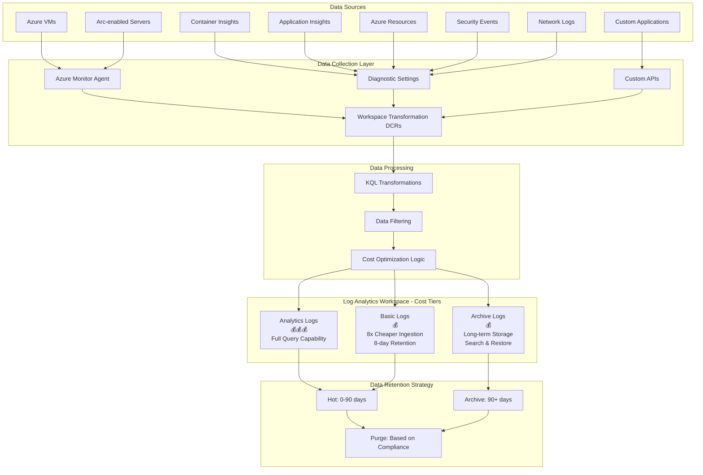

# Cost-Optimized Enterprise Monitoring Architecture for Azure Landing Zones

## Overview

This document provides guidance for designing a cost-effective monitoring solution for Azure Landing Zones, focusing on optimal data routing, retention strategies, and Log Analytics workspace optimization.

## Architecture Diagram



## Data Source to Table Mapping Strategy

### High-Value Data → Analytics Logs

**Cost: High | Query: Full Capability | Retention: Configurable**

| Data Source | Table | Business Value | Sample KQL Transform |
|----|----|----|----|
| Security Events (Critical) | SecurityEvent | 🔴 High | `SecurityEvent | where EventLevelName == "Critical"` |
| Application Performance | AppTraces, AppPerformanceCounters | 🔴 High | Performance monitoring |
| Infrastructure Alerts | Heartbeat, Perf (CPU/Memory) | 🔴 High | `Perf | where CounterName in ("% Processor Time", "Available MBytes")` |
| Audit Logs | AuditLogs | 🔴 High | Compliance tracking |

### Standard Operational Data → Basic Logs

**Cost: 8x Cheaper | Query: Limited | Retention: 8 days**

| Data Source | Table | Business Value | Sample KQL Transform |
|----|----|----|----|
| Windows Event Logs | Event | 🟡 Medium | `Event | where EventLevelName != "Information"` |
| Syslog (Info level) | Syslog | 🟡 Medium | `Syslog | where SeverityLevel != "info"` |
| IIS Logs | W3CIISLog | 🟡 Medium | Web server logs |
| Performance Counters (Standard) | Perf | 🟡 Medium | Non-critical metrics |

### Long-term/Compliance Data → Archive Logs

**Cost: Very Low | Query: Search & Restore | Retention: Years**

| Data Source | Table | Business Value | Use Case |
|----|----|----|----|
| Historical Security Events | SecurityEvent_Archive | 🟢 Compliance | Audit trail |
| Change Tracking History | ConfigurationChange_Archive | 🟢 Compliance | Change history |
| Network Flow Logs | NetworkFlow_Archive | 🟢 Compliance | Network forensics |

## Data Collection Rules (DCR) Configuration

### Workspace Transformation DCR Example

```json
{
  "properties": {
    "description": "Cost-optimized data routing DCR",
    "dataFlows": [
      {
        "streams": ["Microsoft-SecurityEvent"],
        "destinations": ["analytics-logs"],
        "transformKql": "SecurityEvent | where EventLevelName in ('Critical', 'Error', 'Warning')"
      },
      {
        "streams": ["Microsoft-Event"],
        "destinations": ["basic-logs"],
        "transformKql": "Event | where EventLevelName != 'Information' | limit 10000"
      }
    ],
    "destinations": {
      "logAnalytics": [
        {
          "workspaceResourceId": "/subscriptions/{sub}/resourceGroups/{rg}/providers/Microsoft.OperationalInsights/workspaces/{workspace}",
          "name": "analytics-logs"
        },
        {
          "workspaceResourceId": "/subscriptions/{sub}/resourceGroups/{rg}/providers/Microsoft.OperationalInsights/workspaces/{workspace}",
          "name": "basic-logs"
        }
      ]
    }
  }
}
```

## Cost Optimization Strategies

### 1. Data Volume Reduction

* **Sampling**: Reduce high-volume, low-value logs
* **Filtering**: Remove unnecessary fields and events
* **Aggregation**: Pre-aggregate metrics before ingestion

### 2. Intelligent Routing

```kql
// Example: Route based on severity and business impact
SecurityEvent
| extend CostTier = case(
    EventLevelName == "Critical", "analytics",
    EventLevelName in ("Error", "Warning"), "basic",
    "archive"
)
```

### 3. Retention Management

* **Analytics Logs**: 30-90 days for active investigation
* **Basic Logs**: 8 days (automatic)
* **Archive Logs**: 7+ years for compliance

### 4. Table Configuration Examples

```powershell
# Configure table for Basic Logs
Invoke-AzRestMethod -Uri "https://management.azure.com/subscriptions/{subscriptionId}/resourceGroups/{resourceGroupName}/providers/Microsoft.OperationalInsights/workspaces/{workspaceName}/tables/Event_CL?api-version=2021-12-01-preview" -Method PUT -Payload '{
  "properties": {
    "plan": "Basic"
  }
}'
```

## Implementation Recommendations

### Phase 1: Assessment (Week 1-2)


1. **Current Cost Analysis**

   ```kql
   Usage
   | where TimeGenerated > ago(30d)
   | summarize TotalGB = sum(Quantity) by DataType
   | order by TotalGB desc
   ```
2. **Data Value Classification**
   * Critical: Security, compliance, performance issues
   * Standard: Operational logs, diagnostics
   * Archive: Historical, audit trail

### Phase 2: DCR Implementation (Week 3-4)


1. Deploy Workspace Transformation DCRs
2. Configure table plans (Analytics/Basic)
3. Implement data filtering and sampling

### Phase 3: Optimization (Week 5-6)


1. Monitor cost impact
2. Adjust retention policies
3. Fine-tune transformation rules

## Monitoring and Governance

### Cost Tracking Query

```kql
Usage
| where TimeGenerated > ago(7d)
| extend CostTier = case(
    DataType endswith "_CL" and Plan == "Basic", "Basic Logs",
    DataType endswith "_CL", "Analytics Logs",
    "Standard"
)
| summarize TotalGB = sum(Quantity), EstimatedCost = sum(Quantity * 2.3) by CostTier
| order by EstimatedCost desc
```

### Alerts for Cost Anomalies

```json
{
  "alertRule": {
    "criteria": {
      "allOf": [
        {
          "query": "Usage | where TimeGenerated > ago(1d) | summarize TotalGB = sum(Quantity) | where TotalGB > 100",
          "timeAggregation": "Total",
          "threshold": 1,
          "operator": "GreaterThan"
        }
      ]
    }
  }
}
```

## Best Practices Summary

### ✅ Do's

* Use Basic Logs for high-volume, low-criticality data
* Implement aggressive filtering at DCR level
* Archive compliance data for long-term retention
* Monitor costs daily with automated alerts
* Use sampling for verbose application logs

### ❌ Don'ts

* Don't route all data to Analytics Logs
* Don't ignore data classification
* Don't set retention higher than business requirements
* Don't forget to configure table plans
* Don't skip cost monitoring and governance

## Expected Cost Savings

* **40-60%** reduction in ingestion costs through Basic Logs
* **30-50%** reduction through intelligent filtering
* **20-30%** reduction through optimized retention policies
* **Overall: 60-80%** cost optimization potential

## Integration with Azure Landing Zones

This monitoring architecture integrates with ALZ by:

* Leveraging existing Log Analytics workspace in management subscription
* Using ALZ policy assignments for DCR deployment
* Following ALZ governance patterns for cost management
* Aligning with ALZ security and compliance requirements


