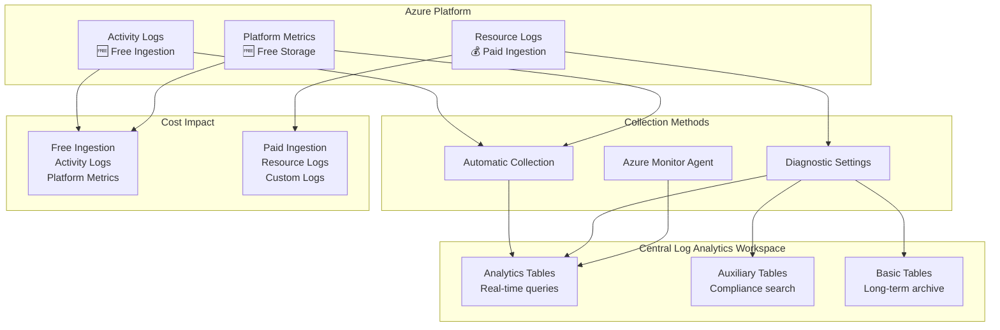

# Azure Landing Zones - Log Analytics Workspace Architecture Design

## Executive Summary

This document provides comprehensive enterprise architecture guidance for implementing Azure Log Analytics Workspace within Azure Landing Zones (ALZ), focusing on table types, data collection rules (DCRs), transformations, and cost optimization strategies with detailed mapping of Azure log types to appropriate destinations.

## Table of Contents

- [Azure Log Types Architecture](#azure-log-types-architecture)
- [Log Analytics Table Types Architecture](#log-analytics-table-types-architecture)
- [Data Collection Rules and Transformations](#data-collection-rules-and-transformations)
- [Enterprise Log Collection Strategy](#enterprise-log-collection-strategy)
- [Cost Optimization Strategy](#cost-optimization-strategy)
- [Enterprise Architecture Recommendations](#enterprise-architecture-recommendations)
- [Implementation Guidance](#implementation-guidance)
- [Visual Architecture Diagrams](#visual-architecture-diagrams)

## Azure Log Types Architecture

### Overview of Azure Log Categories

Azure generates three primary categories of observability data, each with different characteristics, costs, and use cases:

```
┌─────────────────────────────────────────────────────────────────────────────┐
│                         Azure Observability Data Types                      │
├─────────────────────────────────────────────────────────────────────────────┤
│  📋 Activity Logs          │  🔧 Resource Logs         │  📊 Platform Metrics │
│  • Management operations   │  • Service-specific logs  │  • Performance data   │
│  • Who did what, when      │  • Application insights   │  • Resource health     │
│  • FREE ingestion         │  • Diagnostic settings    │  • FREE storage (93d)  │
│  • Subscription level     │  • PAID ingestion         │  • Optional ingestion  │
└─────────────────────────────────────────────────────────────────────────────┘
```

### Detailed Log Type Characteristics

| Log Category | Examples | Ingestion Cost | Default Retention | Collection Method | Enterprise Value |
|-------------|----------|----------------|------------------|-------------------|------------------|
| **Activity Logs** | Resource creation, policy assignments, RBAC changes | ✅ FREE | 90 days | Automatic | ⭐⭐⭐ High - Compliance |
| **Resource Logs** | Application Gateway access logs, Key Vault audit, SQL diagnostics | 💰 PAID | 30 days (basic) | Diagnostic Settings | ⭐⭐⭐ High - Security |
| **Platform Metrics** | CPU%, Memory%, Network I/O, Storage IOPS | ✅ FREE (93 days) | 93 days | Automatic | ⭐⭐ Medium - Monitoring |
| **Custom Logs** | Application logs, security events, custom telemetry | 💰 PAID | 30-730 days | AMA/API | ⭐⭐⭐ High - Business |

### Visual Log Flow Architecture



## Log Analytics Table Types Architecture

### Overview of Table Types

Azure Log Analytics Workspace supports three distinct table types, each with different cost structures and capabilities:

```
┌─────────────────────────────────────────────────────────────────┐
│                    Log Analytics Workspace                      │
├─────────────────────────────────────────────────────────────────┤
│  📊 Analytics Tables        │  🔧 Auxiliary Tables      │  📁 Basic Tables          │
│  • Real-time analytics     │  • Archive/compliance     │  • Long-term storage      │
│  • KQL queries             │  • Search capabilities    │  • Limited query access   │
│  • Full feature set        │  • Cost-effective         │  • Lowest cost option     │
│  • Higher cost per GB      │  • Medium cost per GB     │  • Minimal cost per GB    │
└─────────────────────────────────────────────────────────────────┘
```

### Table Type Characteristics

| Feature | Analytics Tables | Auxiliary Tables | Basic Tables |
|---------|------------------|------------------|--------------|
| **Cost per GB** | $$$ (Highest) | $$ (Medium) | $ (Lowest) |
| **Real-time Analytics** | ✅ Full KQL support | ✅ Limited KQL | ❌ Search only |
| **Analytics Retention** | 4 days - 2 years | 4 days - 2 years | 4 days - 8 years |
| **Long-term Retention** | Up to 12 years (Archive) | Up to 12 years (Archive) | Not applicable |
| **Interactive Retention** | 30-730 days (Hot) | 30-730 days (Hot) | 8 days max |
| **Archive Access** | Search & Restore | Search & Restore | N/A |
| **Query Performance** | Optimized | Standard | Basic search |
| **Alerting** | ✅ Real-time | ✅ Limited | ❌ Not supported |
| **Workbooks/Dashboards** | ✅ Full support | ✅ Limited | ❌ Read-only |
| **Data Export** | ✅ Continuous | ✅ On-demand | ✅ Archive export |

### Azure Log Analytics Retention Architecture

```
┌─────────────────────────────────────────────────────────────────────────────────┐
│                    Azure Log Analytics Retention Framework                      │
├─────────────────────────────────────────────────────────────────────────────────┤
│                                                                                 │
│  🔥 Interactive Retention (Hot Data)        📦 Long-term Retention (Archive)    │
│  ├── 4 days minimum (all tables)           ├── Beyond interactive period       │
│  ├── 30-730 days (Analytics/Auxiliary)     ├── Up to 12 years total           │
│  ├── 8 days maximum (Basic tables)         ├── Search & Restore model         │
│  ├── Real-time query access                ├── Cost-effective storage         │
│  ├── KQL query support                     ├── Archived data restoration      │
│  └── Dashboard integration                 └── Compliance & audit support     │
│                                                                                 │
│  💰 Cost Impact:                           💰 Cost Impact:                     │
│  ├── Full ingestion cost                   ├── Reduced storage cost           │
│  ├── Compute cost for queries              ├── Restoration charges            │
│  └── Storage cost (hot tier)               └── Search operation costs         │
│                                                                                 │
└─────────────────────────────────────────────────────────────────────────────────┘
```

## Enterprise Log Collection Strategy

### Log Source to Destination Mapping

```
┌─────────────────────────────────────────────────────────────────────────────────┐
│                    Enterprise Log Collection Architecture                       │
├─────────────────────────────────────────────────────────────────────────────────┤
│                                                                                 │
│  🏢 Management Group                    📊 Central Log Analytics Workspace      │
│  ├── Platform Subscriptions            ├── Analytics Tables                    │
│  │   ├── Connectivity                  │   ├── Activity Logs (Critical)        │
│  │   ├── Identity                      │   ├── Security Resource Logs          │
│  │   └── Management                    │   └── Real-time Monitoring            │
│  │                                     │                                        │
│  ├── Landing Zone Subscriptions        ├── Auxiliary Tables                    │
│  │   ├── Production Workloads          │   ├── Compliance Resource Logs        │
│  │   ├── Non-Production                │   ├── Audit Trails                    │
│  │   └── Sandbox                       │   └── Governance Data                 │
│  │                                     │                                        │
│  └── Log Sources                       └── Basic Tables                        │
│      ├── Activity Logs (FREE)              ├── Historical Data                 │
│      ├── Resource Logs (PAID)              ├── Long-term Archive               │
│      └── Platform Metrics (FREE)           └── Compliance Archive              │
│                                                                                 │
└─────────────────────────────────────────────────────────────────────────────────┘
```

### Detailed Source-to-Table Mapping

| Log Source | Category | Collection Cost | Recommended Table | Retention Period | Business Justification |
|------------|----------|----------------|-------------------|------------------|----------------------|
| **Activity Logs** | Platform | 🆓 FREE | Analytics | 1-2 years | Compliance, security investigations |
| **Azure AD Sign-ins** | Identity | 💰 PAID | Analytics | 90 days | Security monitoring, fraud detection |
| **Key Vault Audit** | Security | 💰 PAID | Analytics | 2 years | Security compliance, access auditing |
| **Network Security Group Flows** | Network | 💰 PAID | Auxiliary | 90 days | Network troubleshooting, compliance |
| **Application Gateway Access** | Network | 💰 PAID | Auxiliary | 30 days | Performance monitoring, debugging |
| **SQL Database Audit** | Data | 💰 PAID | Analytics | 2 years | Data access compliance, security |
| **Storage Account Logs** | Storage | 💰 PAID | Auxiliary | 1 year | Access patterns, compliance |
| **Virtual Machine Heartbeat** | Compute | 💰 PAID | Basic | 30 days | Availability monitoring |
| **Platform Metrics** | Monitoring | 🆓 FREE (93 days) | Don't Ingest* | N/A | Use native metrics store |

*Platform Metrics recommendation: Keep in native Azure Monitor Metrics store (free for 93 days) rather than ingesting to Log Analytics

### Visual Log Type Decision Tree

```
Start: Azure Log Generated
    ↓
Is this an Activity Log?
    ├─ Yes → Analytics Table (Free ingestion, compliance value)
    └─ No → Continue
        ↓
Is this a Security-related Resource Log?
    ├─ Yes → Analytics Table (Real-time alerting needed)
    └─ No → Continue
        ↓
Is this a Compliance/Audit Resource Log?
    ├─ Yes → Auxiliary Table (Searchable, cost-effective)
    └─ No → Continue
        ↓
Is this a Platform Metric?
    ├─ Yes → Don't Ingest (Use native metrics store)
    └─ No → Continue
        ↓
Is this Historical/Archive data?
    ├─ Yes → Basic Table (Long-term, low cost)
    └─ No → Evaluate business case
```

## Data Collection Rules and Transformations

### DCR Types and Capabilities

#### Standard Data Collection Rules

* **Purpose**: Direct data collection from supported sources
* **Transformation**: KQL-based data transformation at ingestion
* **Target Tables**: Analytics, Auxiliary, Basic
* **Use Cases**: Azure Monitor Agent, custom applications

#### Workspace Transformation DCRs

* **Purpose**: Transform data from legacy sources
* **Sources**: Diagnostic settings, legacy agents, unsupported sources
* **Transformation**: Post-ingestion transformation
* **Target Tables**: Any table type based on transformation logic

### Log Type Transformation Examples

```kql
// Activity Log Transformation - Route to Analytics
AzureActivity
| where CategoryValue in ("Administrative", "Security", "Policy")
| extend TableDestination = "Analytics"
| project TimeGenerated, Caller, OperationName, ResourceGroup, SubscriptionId

// Resource Log Transformation - Route based on severity
AzureDiagnostics
| extend TableDestination = case(
    Category == "AuditEvent" and Result == "Failed", "Analytics",     // Security failures
    Category == "AuditEvent" and Result == "Success", "Auxiliary",   // Compliance
    "Basic"  // Everything else for archive
)
```

## Cost Optimization Strategy

### Enterprise Cost Model with Retention Strategy

```
📊 Cost Optimization Framework with Retention
├── Interactive Retention (Hot Data - High Cost)
│   ├── Security Logs: 90 days (Real-time alerting)
│   ├── Performance Data: 30 days (Operational monitoring)
│   ├── Application Logs: 60 days (Troubleshooting)
│   └── Compliance Logs: 180 days (Regulatory requirements)
├── Long-term Retention (Archive - Low Cost)
│   ├── Security Audit: 7 years (Compliance mandate)
│   ├── Financial Data: 10 years (Regulatory requirement)
│   ├── HR Records: 7 years (Legal requirement)
│   └── Change Logs: 5 years (Audit trail)
└── Cost Control Strategies
    ├── Minimize interactive retention period
    ├── Maximize archive retention usage
    ├── Implement data lifecycle policies
    └── Regular retention policy review
```

### Retention Configuration Examples

#### Interactive Retention Configuration
```json
{
  "properties": {
    "retentionInDays": 90,
    "workspaceCapping": {
      "dailyQuotaGb": 10,
      "quotaNextResetTime": "2024-01-01T00:00:00Z",
      "dataIngestionStatus": "RespectQuota"
    },
    "sku": {
      "name": "PerGB2018"
    }
  }
}
```

#### Long-term Retention (Archive) Configuration
```json
{
  "properties": {
    "totalRetentionInDays": 2555,
    "archiveRetentionInDays": 2190,
    "plan": "Analytics"
  }
}
```

### Retention Cost Analysis by Log Type

| Log Type | Interactive Period | Archive Period | Total Retention | Monthly Cost (Hot) | Monthly Cost (Archive) | Compliance Driver |
|----------|-------------------|----------------|-----------------|-------------------|-------------------|------------------|
| **Activity Logs** | 90 days | 7 years | 7.25 years | $0 (FREE) | $5/month | SOX, PCI DSS |
| **Security Audit** | 90 days | 7 years | 7.25 years | $150/month | $25/month | GDPR, HIPAA |
| **Database Audit** | 180 days | 10 years | 10.5 years | $300/month | $40/month | Financial regulations |
| **Application Logs** | 30 days | 1 year | 1.08 years | $200/month | $15/month | Operational needs |
| **Network Flows** | 30 days | 90 days | 120 days | $500/month | $0 | Performance only |

## Enterprise Architecture Recommendations

### Multi-Subscription Log Collection Strategy

```
Enterprise Scale Landing Zones - Log Collection Architecture
├── Management Subscription
│   └── Central Log Analytics Workspace
│       ├── Analytics Tables
│       │   ├── Activity Logs (All subscriptions) - FREE
│       │   ├── Security Resource Logs - PAID
│       │   └── Real-time Monitoring Logs - PAID
│       ├── Auxiliary Tables
│       │   ├── Compliance Resource Logs - PAID
│       │   └── Governance Data - PAID
│       └── Basic Tables
│           ├── Historical Archive Data - PAID
│           └── Long-term Compliance Data - PAID
├── Connectivity Subscription
│   ├── Network Flow Logs → Auxiliary Tables
│   ├── Firewall Logs → Analytics Tables
│   └── VPN/ExpressRoute Logs → Analytics Tables
├── Identity Subscription
│   ├── Azure AD Sign-ins → Analytics Tables
│   ├── Conditional Access → Analytics Tables
│   └── Identity Protection → Analytics Tables
└── Landing Zone Subscriptions
    ├── Application Logs → Analytics/Auxiliary (based on criticality)
    ├── Database Audit Logs → Analytics Tables
    └── Storage Access Logs → Auxiliary Tables
```

### Enterprise Recommendations by Log Type

#### Activity Logs - ALWAYS COLLECT (FREE)
- **Collection**: Automatic to Log Analytics Workspace
- **Table Type**: Analytics
- **Retention**: 1-2 years
- **Justification**: Free ingestion, essential for compliance and security
- **Configuration**: Export to central Log Analytics in Management subscription

#### Resource Logs - SELECTIVE COLLECTION (PAID)

| Resource Type | Logs to Collect | Table Type | Retention | Priority |
|---------------|----------------|------------|-----------|----------|
| **Key Vault** | AuditEvent | Analytics | 2 years | 🔴 Critical |
| **SQL Database** | SQLSecurityAuditEvents, Audit | Analytics | 2 years | 🔴 Critical |
| **Azure AD** | SignInLogs, AuditLogs | Analytics | 90 days | 🔴 Critical |
| **Network Security Groups** | NetworkSecurityGroupFlowEvent | Auxiliary | 90 days | 🟡 Medium |
| **Application Gateway** | ApplicationGatewayAccessLog | Auxiliary | 30 days | 🟡 Medium |
| **Storage Account** | StorageRead, StorageWrite | Auxiliary | 1 year | 🟡 Medium |
| **Virtual Machines** | Heartbeat, Syslog | Basic | 30 days | 🟢 Low |

#### Platform Metrics - DON'T INGEST (FREE NATIVE STORAGE)
- **Recommendation**: Keep in native Azure Monitor Metrics
- **Reason**: Free storage for 93 days, purpose-built for metrics
- **Alternative**: Use Azure Monitor Metrics for dashboards and alerts
- **Exception**: Only ingest if long-term correlation with logs is required

### Visual Decision Framework

```
┌─────────────────────────────────────────────────────────────────────────────────┐
│                        Enterprise Log Collection Decision Matrix                 │
├─────────────────────────────────────────────────────────────────────────────────┤
│                                                                                 │
│  📋 ALWAYS COLLECT               🔐 SECURITY LOGS              📊 METRICS        │
│  ├── Activity Logs (FREE)       ├── Key Vault Audit          ├── Keep Native    │
│  ├── Azure AD Audit             ├── SQL Audit                │   (FREE 93d)     │
│  └── Policy Compliance          ├── Security Center          └── Don't Ingest   │
│                                 └── Defender Alerts                              │
│                                                                                 │
│  🔍 COMPLIANCE LOGS              📱 APPLICATION LOGS          🗃️ ARCHIVE          │
│  ├── Resource Access            ├── Custom App Logs          ├── Historical     │
│  ├── Data Plane Operations      ├── Performance Counters     ├── Old Compliance │
│  └── Governance Events          └── Error Logs               └── Backup Audit   │
│                                                                                 │
└─────────────────────────────────────────────────────────────────────────────────┘
```

## Implementation Guidance

### Phase 1: Foundation Setup (Free Sources First)
1. **Deploy Central Log Analytics Workspace**
   - Configure in Management subscription
   - Set up basic table structure
   - Enable Activity Log export (FREE)

2. **Configure Activity Log Collection**
   ```json
   {
     "properties": {
       "logs": [
         {
           "category": "Administrative",
           "enabled": true,
           "retentionPolicy": {
             "enabled": true,
             "days": 730
           }
         },
         {
           "category": "Security",
           "enabled": true,
           "retentionPolicy": {
             "enabled": true,
             "days": 730
           }
         }
       ],
       "workspaceId": "/subscriptions/{subscription-id}/resourceGroups/{rg}/providers/Microsoft.OperationalInsights/workspaces/{workspace}"
     }
   }
   ```

### Phase 2: Critical Security Logs (Paid Sources)
1. **Implement High-Value Resource Logs**
   - Key Vault audit logs → Analytics Tables
   - Azure AD sign-ins → Analytics Tables
   - SQL audit logs → Analytics Tables

2. **Configure Diagnostic Settings**
   ```json
   {
     "properties": {
       "logs": [
         {
           "category": "AuditEvent",
           "enabled": true,
           "retentionPolicy": {
             "enabled": true,
             "days": 730
           }
         }
       ],
       "workspaceId": "/subscriptions/{subscription-id}/resourceGroups/{rg}/providers/Microsoft.OperationalInsights/workspaces/{workspace}"
     }
   }
   ```

### Phase 3: Compliance and Archive (Cost-Optimized)
1. **Implement Auxiliary Table Strategy**
   - Network logs → Auxiliary Tables
   - Access logs → Auxiliary Tables
   - Compliance data → Auxiliary Tables

2. **Implement Basic Table Strategy**
   - Historical data → Basic Tables
   - Archive compliance → Basic Tables
   - Long-term retention → Basic Tables

### Metrics Strategy - Keep Native

```yaml
platform_metrics_strategy:
  recommendation: "DONT_INGEST_TO_LOG_ANALYTICS"
  reasoning:
    - "Free storage for 93 days in native metrics store"
    - "Purpose-built for time-series data"
    - "Better performance for metric queries"
    - "Native alerting and dashboard integration"
  
  alternative_approach:
    monitoring: "Use Azure Monitor Metrics Explorer"
    alerting: "Use Azure Monitor Metric Alerts"
    dashboards: "Use Azure Monitor Workbooks with Metrics queries"
    
  exceptions:
    - "Long-term correlation analysis with logs"
    - "Custom business intelligence requirements"
    - "Specific compliance mandates requiring log format"
```

## Monitoring and Alerting Strategy

### Alert Classification by Log Type and Table

| Alert Type | Log Source | Table Type | Response Time | Example Query |
|------------|------------|------------|---------------|---------------|
| **Security Incident** | Activity Logs, Key Vault | Analytics | < 5 minutes | Failed admin operations |
| **Compliance Violation** | Resource Logs | Auxiliary | < 1 hour | Unauthorized access attempts |
| **Performance Issue** | Platform Metrics | Native Store | < 15 minutes | CPU > 80% |
| **Capacity Planning** | Usage data | Basic | < 24 hours | Growth trend analysis |

## Best Practices and Recommendations

### Data Lifecycle Management with Retention Strategy
1. **Interactive Retention (Hot Data)**
   - Security logs: 90 days for real-time investigation
   - Application logs: 30-60 days for operational troubleshooting
   - Performance data: 30 days for capacity planning
   - Compliance logs: 180 days for regulatory requirements

2. **Archive Retention (Cold Data)**
   - Security audit: 7 years for compliance (SOX, PCI DSS)
   - Financial records: 10 years for regulatory requirements
   - HR and employee data: 7 years for legal compliance
   - Change and configuration logs: 5 years for audit trails

3. **Cost Control with Retention**
   - Minimize interactive retention to business requirements only
   - Use archive retention for long-term compliance needs
   - Implement automated data lifecycle policies
   - Regular review and optimization of retention periods
   - Monitor retention costs with detailed cost allocation

4. **Retention Policy Governance**
   - Document retention requirements by data classification
   - Implement approval workflows for retention changes
   - Regular compliance reviews of retention configurations
   - Automated alerting for retention policy violations
   - Cost impact analysis before retention period changes